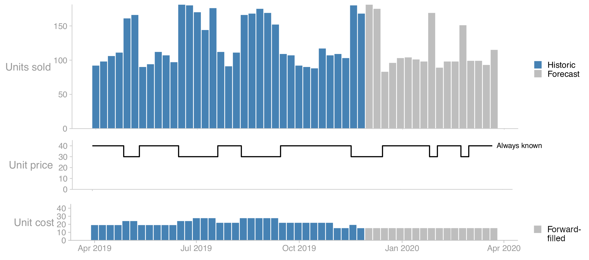

# data-engineer assignment

# 0. Preparation

1. Create a new private repository and push the original assignment to it
2. Create a pull request in your new repo with your implementation, write a short description of your solution and flag for any constraints and/or trade-offs in your code. Treat it as you would like to treat any PR at work
3. Ask your contact person for reviewers to assign to your PR. Hopefully you'll exchange some comments & feedback before having a follow up discussion in person or online.

# 1. Code task

The task is to construct a HTTP server that listens on `http://localhost:8080`,
takes in a hierarchy of items in a flat structure (`CSV`), and returns it as a
nested hierarchical structure (`JSON`).

## Running the tests

The tests are defined in `io_test.go` and can be run with `go test`.

Note that the code can be written in any language of choice (e.g. Python, Java, Scala, Go etc).

## The task

The input payload has the following schema:

| Column    | Type   | Required                                |
| --------- | ------ | --------------------------------------- |
| `level_1` | String | Yes                                     |
| `level_2` | String | Yes if `level_3` is given, otherwise no |
| `level_3` | String | No                                      |
| `item_id` | String | Yes                                     |

An example input:

```csv
level_1,level_2,item_id
category_1,category_2,item_1
category_1,category_3,item_2
```

The task is to respond with the following schema:

```json
{
  "children": {
    "$id": {
      "children": {
        "$item_id": {
          "item": true
        }
      }
    }
  }
}
```

For example:

```json
{
  "children": {
    "category_1": {
      "children": {
        "category_2": {
          "children": {
            "item_1": {
              "item": true
            }
          }
        },
        "category_3": {
          "children": {
            "item_2": {
              "item": true
            }
          }
        }
      }
    }
  }
}
```

## Special cases

Levels that contain empty strings should be interpreted as the end of that
hierarchy branch, for example:

```csv
level_1,level_2,item_id
category_1,,item_1
category_2,category_3,item_2
```

Corresponds to the following `JSON`:

```json
{
  "children": {
    "category_1": {
      "children": {
        "item_1": { "item": true }
      }
    },
    "category_2": {
      "children": {
        "category_3": {
          "children": {
            "item_2": { "item": true }
          }
        }
      }
    }
  }
}
```

Missing columns should be interpreted as empty for the remainder of that hierarchy path.

Inputs where level _n_ is empty but level _n+1_ is non-empty should return the
[http status code `Bad Request`][400] as these constitute an invalid structure.
The following, for example is an example of such an invalid payload:

```csv
level_1,level_2,item_id
,category_2,item_1
```

[400]: https://en.wikipedia.org/wiki/List_of_HTTP_status_codes#4xx_Client_errors

## Solution

The details of the design and implementation of the code task can found in ["Code Task - Data Engineering API Endpoint"](code_task.md).


# 2. Design task

The design task is a discussion-based task. In preparation for it, please write down a few notes and share it with us beforehand. The notes are to be used as a basis for discussion - we find it easier to have a worthwhile discussion with the applicant if they jot something down beforehand as it allows us to prepare questions. The notes do not need to be comprehensive, they simply need to outline the answers to the questions.

The discussion will be had with 1-2 data engineers to answer the question:

> How would you design a system to validate time-based forecasts?
> What key aspects are there to consider?

In simplified terms, we help retailers forecast their sales into the future in terms of units sold, revenue, and profit (`profit = units sold * (unit price - unit cost)`).

For these three to be calculated the following inputs are required:

- **Units sold.** Aggregated to the calendar week window. The target feature of our forecasts.
- **Unit price.** Expressed as a timestamped event log consisting of past and future price changes.
- **Unit cost.** Provided per calendar week window, but only for historic dates. For simplicity, we assume that the cost in the future is that of the last observation.

We employ the [rolling origin](https://cran.r-project.org/web/packages/greybox/vignettes/ro.html) validation strategy when evaluating the performance of our models. It means that we train a sequence of models, iteratively extending the training set with more recent data, and moving the test set forward in time.



- On a high level, how would you design a data model/schema in a database, e.g. PostgreSQL or BigQuery, to support the above forecast validation?
- How would you make sure that we can:
  - Store the outputs of several validation rounds, i.e. successively rolled windows in the rolling validation strategy?
  - Store the outputs of several model experiments?
- How would you design a pipeline that allows for running parameterized validation?
- Some features that act like an event log, like price, will need to be "gridded" to the relevant date. What method would you use to join it into the relevant time window?
- Some features that are unknown in the future, like cost, will need to be filled in for future dates. What method would you use to _forward fill_ them into future time windows?
