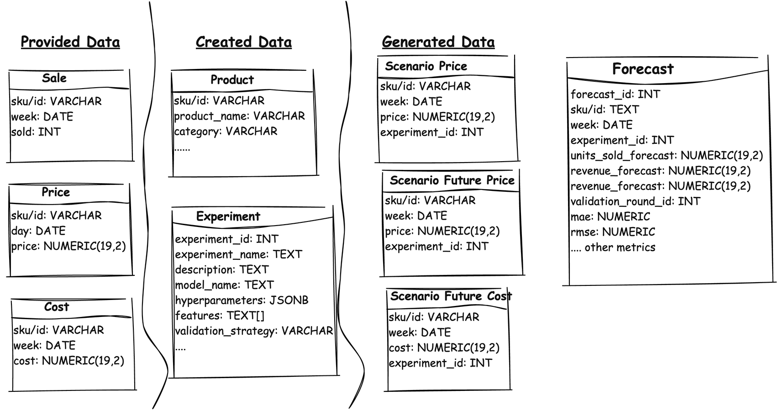

# Design Task: Time-based Forecast Validation

**Objective:** Build an API endpoint to evaluate the accuracy of time-based sales forecasts for retailers.

**Context:** Our platform provides retailers with sales forecasts (units sold, revenue, profit) projected into the future. This API will assess the performance of those forecasts.

## Core Requirements:

To effectively design this validation system, we need to consider two key perspectives:

### Functional Requirements - What the system does
These requirements outlines the specific actions and operations the API should perform. For example, how it receives forecast data, what validation metrics it calculates, and how it outputs the results.

* **Who's using it?** Data science teams who develop forecasting models for various retailers.

* **What's is it doing?** The API focuses on evaluating the accuracy of three key predictions:
    * **Units sold:** Based on `units sold` that is aggregated to the calendar week window
    * **Revenue:** Calculated as `units sold * unit price`.
    * **Profit:** Calculated as `units sold * (unit price - unit cost)`.

* **How is it done:** To ensure our forecasts are accurate, we use a technique called "time series cross-validation" with a "rolling window," as specified in the high-level system specification. This approach involves splitting our historical data (e.g., units sold each week) into two parts: a "training" set and a "test" set.  We use the "training" set to teach our forecasting model how to predict and then test its accuracy on the "test" set. To simulate real-world forecasting, we move the split between the "training" and "test" sets forward in time, creating new sets and retraining the model. This "rolling window" approach helps ensure our model can adapt and provide accurate predictions as new data becomes available.

* **How is performance measured?** Based on research, here are some established forecasting metrics that can be used in the validation system:
    * Mean Absolute Error (MAE): Average absolute difference between actual and forecasted values.
    * Mean Squared Error (MSE): Average of squared differences between actual and forecasted values.
    * Root Mean Squared Error (RMSE): Square root of the MSE.
    * Mean Absolute Percentage Error (MAPE): Average percentage error between actual and forecasted values.
    * Symmetric Mean Absolute Percentage Error (sMAPE): A more balanced version of MAPE, addressing its bias towards negative errors.
    * Mean Absolute Scaled Error (MASE): A robust metric suitable for both seasonal and non-seasonal time series data.
    * Mean Squared Logarithmic Error (MSLE): Measures the ratio between forecasted and actual values.

    > **Important Notes:** 
    > - These metrics are calculated using actual and forecasted values, which we can get from the input data.  From my limited research Relex also use metrics such as Forecast Bias, Mean Absolute Deviation (MAD), and Mean Absolute Percentage Error (MAPE), all of which are based on the same underlying data.

* **What is required:** 

    Based on the functional requirements identified for a successful retail price forecasting machine learning model, the following data categories are anticipated: provided, obtained, and generated. This categorization clarifies the data pipeline and ensures all necessary data points are accounted for.

    * **Provided Data (Transactional)**

        These data likely originates from upstream systems.

        | Data Point | Generation Frequency | Update Frequency | Querying Requirements | Source |
        |------------|----------------------|------------------|-----------------------|--------|
        | Units Sold | Weekly (aggregated)  | Rarely           | Rarely                | ?      |
        | Units Price| Daily (event log)    | Rarely           | Rarely                | ?      |
        | Unit Cost  | Weekly (Historical)  | Rarely           | Rarely                | ?      |

    * **Created Data**
        
        This reference data is necessary for model training and operation. It could be created by data scientist when building the models

        **1. Product Related Data**

        | Data Point | Description | Generation Frequency | Update Frequency | Querying Requirements | Source |
        |------------|-------------|----------------------|------------------|-----------------------|--------|
        | Product Attributes | Category, branding, SKU, color, etc.  | Frequent (new products)| Frequent (model management)|Frequent (model management)|Upstream product catalogs (?)|

        **2. Model Related Data**

        | Data Point | Description | Generation Frequency | Update Frequency | Querying Requirements | Source |
        |------------|-------------|----------------------|------------------|-----------------------|--------|
        | Model Configuration | Seasonality (day of week, month, etc.) | Frequent (new models) | Frequent (model updates) |Frequent (model management)|Part of model configuration|

    * **Generated Data**
        This is data generated by for running the models or by the validation system.

        **1. Forecast Data**

        | Data Point | Description | Generation Frequency | Update Frequency | Querying Requirements | Source |
        |------------|-------------|----------------------|------------------|-----------------------|--------|
        | Model Output | Forecast data generated by the models | Frequent (running models) | Should not be updated |Frequent (model management)|Forecast systems|

        **2. Generated Product Transactional Data**

        | Data Point | Description | Generation Frequency | Update Frequency | Querying Requirements | Source |
        |------------|-------------|----------------------|------------------|-----------------------|--------|
        | Derived Metrics | Unit Price | Frequent (model creation) | Rarely |Frequent (model management)|?|

### Non-Functional Requirements - How the system performs
These requirements defines the quality attributes of the API.  This includes aspects like response times, scalability to handle varying data volumes, and reliability in providing consistent and accurate validation.

* **Performance**
    * **Latency:** Forecasting validation and data retrieval should be fast, ideally within a few seconds or minutes, to support quick decision-making.
    * **Throughput:** The system should be able to handle a large volume of data and complex concurrent queries.
    * **Scalability:** The system should be able to scale horizontally to accommodate growing data volumes and validating complex models with more features.
* **Reliability**    
    * **Data Integrity:** The system should ensure data accuracy and consistency through data validation, error checking, and backup mechanisms.
    * **Fault Tolerance:** The system should be able to recover from errors or failures gracefully, without data loss or significant disruption.
* **Security**
    * **Data Confidentiality:** Sensitive data like pricing strategies, cost information, and sales data should be protected from unauthorized access.
    * **Access Control:** Implement role-based access control to restrict access to certain data and functionalities based on user roles.
    * **Data Encryption:** Encrypt sensitive data both in transit and at rest to protect it from breaches.
* **Maintainability**
    * **Code Maintainability:** The system should be designed with modularity and code reusability in mind to facilitate updates and maintenance.
    * **Testability:** The system should be easily testable, with automated tests to ensure code quality and functionality.
    * **Deployability:** The system should be easy to deploy and update, with minimal manual intervention.
* **Usability**
    * **Ease of Use:** The system should have a user-friendly interface that allows users to easily input data, run forecasts, and interpret results.
    * **Data Visualization:** Provide clear and informative visualizations to help users understand trends, patterns, and forecast accuracy.
    * **Documentation and Training:** Comprehensive documentation, including user manuals, tutorials, and FAQs, should be readily available to guide users. Training materials should be provided to ensure users can effectively utilize the system's features and understand its outputs.  The system should prioritize utilizing familiar and industry-standard technologies to minimize the learning curve and cognitive overload for users.
* **Cost**
    * **Elastic Resources:** Given the variety in the volume of data involved, certain runs will run more compute resources that can be scaled when required. When processing is low, the scaled resources should be removed.
    * **Shareable Resources:** In a multi-tenant environment data confidentiality is a big requirement meaning data should be protected on a need to access basis. But compute resources like application microservices or distributed systems like Spark, Dataflow, Temporal could be shared if as long as the data being processed is no shared within a single run.
    * **Storage:** The system requires vast volume of the data to be stored for processing or analysis. But with time series forcasting, older data gets less relevant to the forecasting models and could be placed in cold storage or removed from the system.
* **Cost Optimization**
    * **Elastic Compute:** To handle fluctuations in data volume and processing demands, the system should leverage elastic compute resources. This allows for scaling resources up or down based on need, optimizing cost efficiency.
    * **Resource Sharing:** In a multi-tenant environment, prioritize data confidentiality while maximizing resource utilization. Shareable compute resources, such as application microservices or distributed systems like Spark, Dataflow, or Temporal, can be employed across tenants, provided data isolation is strictly enforced within each run.
    * **Storage Tiering:** Implement a tiered storage strategy to manage the vast volumes of data required. While recent data is crucial for forecasting, older, less relevant data can be moved to cheaper cold storage or archived, reducing overall storage costs.
    * **Economy of Scale:** Leverage the benefits of multi-tenant resource sharing to maintain a minimum baseline of resource utilization. This avoids the cost and latency penalties associated with constantly cold-starting expensive dynamic pricing models, leading to significant cost savings.

### High-Level System Design

#### Data Schema

The system relies on a robust data pipeline that incorporates three distinct data types, as illustrated in the simplified data schema diagram:

* **Provided Data:** This foundational data originates from upstream systems and remains largely static. It serves as the primary input for machine learning models and the validation system.

* **Created Data:** Data scientists and product systems contribute to this category. It encompasses data specifically engineered for model training and validation processes.

* **Generated Data:** This category encompasses all data generated by the machine learning models and the validation system. It's divided into two subtypes:
    * **Forecast Input:** This data provides the necessary inputs for generating forecasts.
        * **Aggregated Price:** This summarizes historical prices to align with the weekly sales and cost data. Different aggregation methods are used to create various scenarios, such as using moving averages, selecting specific days, or considering seasonal patterns.
        * **Future Price:** To forecast into the future, ther is a need to estimate future prices. Techniques like moving averages, forward-filling, trend analysis, and seasonal patterns to generate these estimates.
        * **Future Cost:**  Similar to future price, future costs are estimated using methods like moving averages, forward-filling, trend analysis, and seasonal patterns.
    * **Forecast Input:** This data comprises the actual forecasts generated by the models and the associated validation metrics, providing insights into forecast accuracy and model performance.

#### System Architecture

## References

* [System Design for Interviews and Beyond by Mikhail Smarshchok](https://leetcode.com/explore/interview/card/system-design-for-interviews-and-beyond)
* [Cross-Validation for Time Series Forecasting | Python Tutorial by Egor Howell](https://youtu.be/1rZpbvSI26c)
* [Crossvalidation for Time Series - Jupyter Notebook by Egor Howell](https://github.com/egorhowell/Youtube/blob/main/Time-Series-Crash-Course/14.%20Crossvalidation.ipynb)
* [Rolling Origin](https://cran.r-project.org/web/packages/greybox/vignettes/ro.html)
* [Forecasting Metrics | How To Evaluate Your Time Series Forecast by Egor Howell](https://youtu.be/jhh4tHYmVew)
* [Measuring forecast accuracy: The complete guide
by Relex Solutions](https://www.relexsolutions.com/resources/measuring-forecast-accuracy/)
* [Demand forecasting for retail and consumer goods: The complete guide by Relex Solutions](https://www.relexsolutions.com/resources/demand-forecasting/)
* [The complete guide to machine learning in retail demand forecasting](https://www.relexsolutions.com/resources/machine-learning-in-retail-demand-forecasting/)
* [SketchWow](https://www.sketchwow.com/)
* [Handling Missing Values - Amazon Forecast Documentation](https://docs.aws.amazon.com/forecast/latest/dg/howitworks-missing-values.html#:~:text=When%20choosing%20a%20filling%20logic,predictor%20to%20be%20over%2Dbiased)